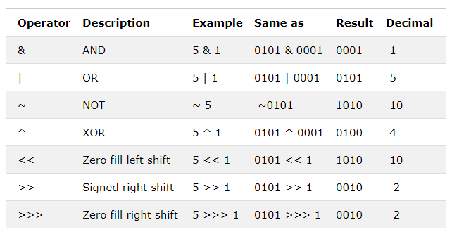

# JavaScript Operators

## 산술연산, 대입연산
```
+, -, *, 
** : 지수연산,
/, %

- 증감연산
++, --
```
대입연산은 증감연산자를 제외하고 각 연산자 오른쪽에 =를 붙인 것이다. 단독으로 쓰는 = 도 대입연산자이다.

```js
var x=10;
x**=2;
```

## 문자열 연산
```+``` 연산자는 문자열끼리를 병합(concatenate)할 수 있다. ```+=``` 연산도 마찬가지이다.
```js
var tx1="john";
var tx2="doe";
var tx3=tx1+' '+tx2;
console.log(tx3);
```

## 문자열과 숫자 더하기
두개의 숫자를 더하는 것은 **합이 반환**되지만, 숫자와 문자열을 더하는 것은 **문자열이 반환**된다.
```js
var x=5+5;
var y="5"+5;
var z="hello"+5;
console.log(x); //10
console.log(y); //55
console.log(z); //hello5
```

## 비교 연산자
'>', '<', '>=', '<=' 는 다른 언어에서 처럼 똑같다. 제일 차이나는 점이, equal, not equal 연산이다.
```===```:equal value and equal type (타입과 value 검사)
```!==```:not equal value or not equal type 
```js
var x=5;
console.log(x==5); //t
console.log(x=="5"); //t

console.log(x===5); //t
console.log(x==="5"); //f

console.log(x!=5); //false
console.log(x!="5"); //false //왜냐하면 같으니까!

console.log(x!==5); // false
console.log(x!=="5"); // true //드디어 다르다고 판단!

```

## 논리연산
- &&: 논리 and
- ||: 논리 or
- ! : 논리 not

## 타입 연산
- typeof : 해당 변수의 타입을 리턴
- instanceof: 개체가 개체유형의 인스턴스일 경우 true 반환

## 비트 연산
