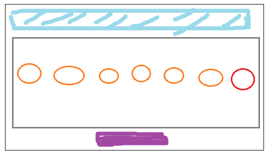
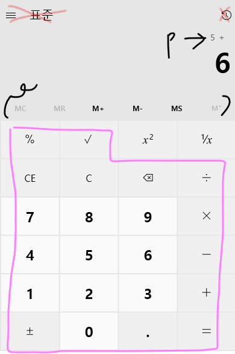

# 5월 2일 daily project
1. 로또 프로그램
2. 계산기

## 자바스크립트를 이용한 로또 프로그램 작성하기
#### 목적 및 분석
1. html과 css 등을 이용하여 보여줄 것.
2. 랜덤함수(1~45), 총 7개 (1개는 보너스)
3. 각 숫자는 중복안됨
4. (hidden) 시간차를 두고 나타남
- 하늘색: title
- 주황색: 각 숫자
- 빨간색: 보너스 숫자
- 보라색: 버튼
    1. start-> 회색에 숫자들이 나타남
    2. restart로 다시 시작할 수 있음
    3. restart시 회색의 숫자가 다 사라지고 자동으로 시작함.

## 계산기 작성하기
#### 목적 및 분석
1. html과 css 등을 이용하여 보여줄 것.
2. 각 버튼(계산기에 알맞는)이 있어야 하고 그에 따른 출력값
3. 출력값은 누를때마다 계속 변해야함

- 빨간색: 구현안함
- 분홍색: 우선적으로 구현되어야 하는 부분
- MC, MR, M+ ... 같은 것들은 나중에
- P라고 적힌 것 처럼 저렇게 지금까지의 내용이 나와있어야함
    - =을 누르면 결과값이 나오고 사라짐
    - 숫자를 누르면 계속해서 커져야한다.
    - 위의 상태에서 다시 연산자를 누르면 나와있는 숫자를 연산한다.

